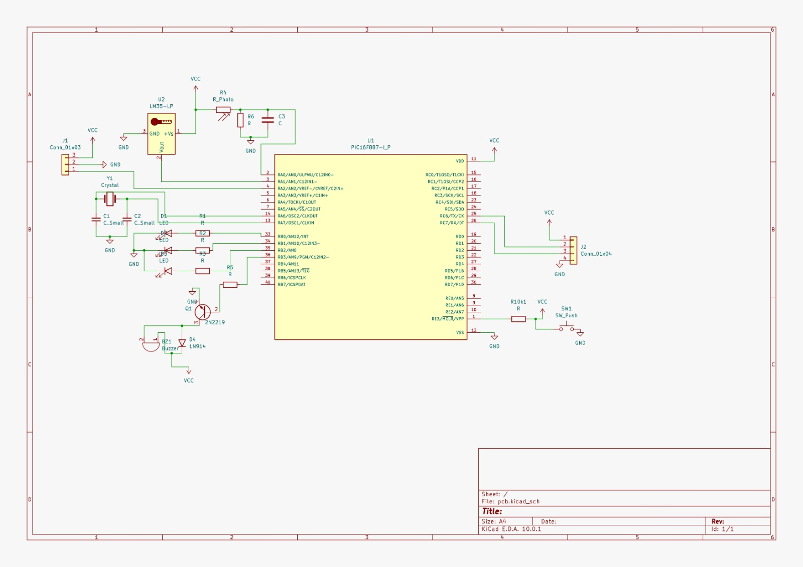
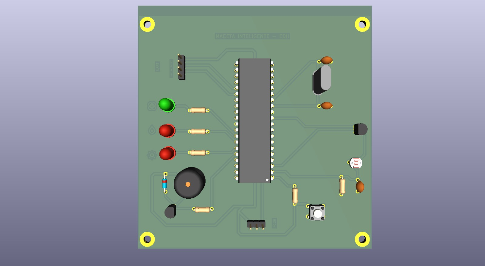
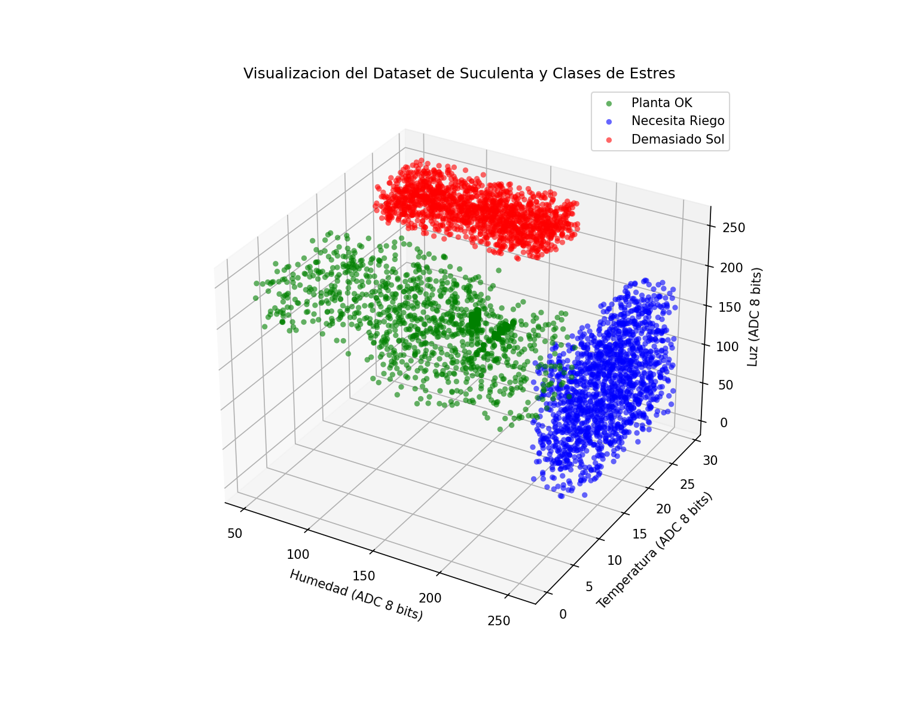

<div align="center">

# 🌱 Maceta Inteligente — PIC16F887

### Sistema embebido de monitoreo de plantas con IA en Assembly puro

[](firmware/main.asm)
[](ml/train.py)
[](visualizer/)
[](#)

**Trabajo Práctico Final — Electrónica Digital II**

</div>

---

## 📋 Índice

- [Descripción del Proyecto](#-descripción-del-proyecto)
- [Arquitectura General](#-arquitectura-general)
- [Hardware](#%EF%B8%8F-hardware)
- [Firmware (Assembly)](#-firmware-assembly)
- [Modelo de IA: Perceptrones en Cascada](#-modelo-de-ia-perceptrones-en-cascada)
- [Dashboard Web](#-dashboard-web)
- [Entrenamiento en Python](#-entrenamiento-en-python)
- [Estructura del Repositorio](#-estructura-del-repositorio)
- [Cómo ejecutar](#-cómo-ejecutar)

---

## 🌟 Descripción del Proyecto

La **Maceta Inteligente** es un sistema embebido completo que monitorea el estado de salud de una planta en tiempo real. El firmware está escrito **100% en Assembly** para el microcontrolador **PIC16F887** e integra un modelo de **Machine Learning** (perceptrón lineal) corriendo directamente en el hardware.

El sistema:
1. **Lee** tres sensores analógicos (humedad, temperatura, luz) mediante el módulo ADC interno del PIC.
2. **Clasifica** el estado de la planta en tiempo real usando una red neuronal en punto fijo Q8 corriendo en Assembly puro — sin float, sin FPU.
3. **Actúa** sobre LEDs y buzzer para alertar al usuario.
4. **Transmite** telemetría por UART a una PC donde un dashboard web lo visualiza en tiempo real.

> **Por qué es interesante:** Implementar ML en un microcontrolador de 8 bits sin soporte de punto flotante requiere aritmética de punto fijo Q8 — la misma técnica usada en sistemas embebidos de producción.

---

## 🏗️ Arquitectura General

```
┌─────────────────────────────────────────────────────────────────────┐
│                          PC / Dashboard                              │
│  ┌─────────────────────────────────────────────────────────────┐   │
│  │  visualizer/  (Python WebSocket + HTML/CSS/JS)              │   │
│  │  • Dashboard en tiempo real con animación pixel-art          │   │
│  │  • Gráficas históricas de sensores                          │   │
│  │  • Log CSV de sesión                                         │   │
│  │  • Modo SIMULATOR (sin hardware físico)                      │   │
│  └───────────────────────┬─────────────────────────────────────┘   │
│                           │ UART / USB Serial (9600 baud)           │
└───────────────────────────┼─────────────────────────────────────────┘
                            │
┌───────────────────────────▼─────────────────────────────────────────┐
│                      PIC16F887 @ 4MHz                                │
│                                                                      │
│  ADC (10-bit)          Perceptrón en Cascada (Q8)    GPIO / UART    │
│  ┌──────────┐          ┌───────────────────────┐     ┌───────────┐  │
│  │ AN0: Luz │──────────▶ Neurona 1: ¿RIEGO?   │─────▶ LED Azul  │  │
│  │ AN1: Tem │          │ Neurona 2: ¿SOL?      │─────▶ LED Rojo  │  │
│  │ AN2: Hum │          │  → Clase 0 / 1 / 2    │─────▶ LED Verde │  │
│  └──────────┘          └───────────────────────┘     │ Buzzer    │  │
│                                                       └───────────┘  │
└──────────────────────────────────────────────────────────────────────┘
         ▲               ▲               ▲
    LDR (Luz)       LM35 (Temp)    FC-28 (Hum)
```

---

## 🛠️ Hardware

| Componente | Descripción |
|---|---|
| **Microcontrolador** | PIC16F887 — 8KB Flash, 368B RAM, 8 bits, 4 MHz |
| **Sensor Humedad** | FC-28 Higrómetro de suelo (AN2) |
| **Sensor Temperatura** | LM35 — 10mV/°C (AN1) |
| **Sensor Luz** | LDR en divisor resistivo (AN0) |
| **Comunicación** | UART → CP2102/MAX232 → USB |
| **Actuadores** | 3× LED (Verde/Azul/Rojo) + Buzzer en PORTB |
| **Oscilador** | Cristal XT externo 4 MHz |

### Esquemático



*Diagrama de conexionado completo del PIC16F887 con los tres sensores analógicos, LEDs, buzzer y módulo UART.*

### PCB 3D



*PCB diseñada con pistas de señal analógica separadas de conmutaciones digitales y capacitores de desacoplamiento de 100nF en los pines de alimentación del PIC.*

---

## ⚙️ Firmware (Assembly)

El firmware (`firmware/main.asm`) implementa un esquema **superloop no bloqueante** coordinado con una **ISR por Timer0**:

```
┌─────────────────────────────────────────────────────────────────┐
│ Superloop (Main Loop)          │  ISR Timer0 @ 1ms              │
│                                │                                 │
│  ┌─ Espera flag 500ms ─────┐   │  • Guarda contexto W/STATUS    │
│  │                          │   │  • Recarga Timer0 = 6          │
│  └▶ Lee ADC x3 (AN0/1/2)  │   │  • Decrementa contadores       │
│     → Convierte a 8 bits   │   │  • Si expiró 500ms → setea     │
│     → Evalúa Neurona 1     │   │    bandera FLAGS,0              │
│     → Si Riego → CLASE=1   │   │  • Control no bloqueante        │
│     → Evalúa Neurona 2     │   │    del Buzzer (toggle RB3)      │
│     → Si Sol → CLASE=2     │   │  • Restaura contexto           │
│     → Else → CLASE=0 (OK)  │   │  • RETFIE                      │
│     → Actualiza LEDs        │   │                                 │
│     → Envía UART 7 bytes   │   │                                 │
│     → Vuelve a esperar     │   │                                 │
└────────────────────────────┘   └─────────────────────────────────┘
```

**Protocolo UART (binario, 9600 baud):**
```
PIC → PC:  [0xFF][LUZ_H][LUZ_L][TEMP_H][TEMP_L][HUM_H][HUM_L]   (7 bytes, cada 500ms)
PC  → PIC: [CLASE (0/1/2)]                                         (1 byte de respuesta)
```

---

## 🧠 Modelo de IA: Perceptrones en Cascada

### El problema

Un perceptrón clásico es un clasificador **binario**. El sistema necesita distinguir 3 estados. En lugar de recurrir a Softmax (imposible en Assembly de 8 bits), se diseñó una arquitectura de **cascada de prioridades**:

```
Sensores (Hum, Temp, Luz)
         │
         ▼
┌─────────────────────┐
│  Neurona 1          │  ¿Necesita RIEGO? (prioridad alta)
│  z1 = Σ(x·w₁) + b₁ │
└──────────┬──────────┘
           │ z1 ≥ 0 → CLASE 1: ALERTA RIEGO 🔵
           │ z1 < 0  ↓
┌─────────────────────┐
│  Neurona 2          │  ¿Demasiado SOL? (prioridad media)
│  z2 = Σ(x·w₂) + b₂ │
└──────────┬──────────┘
           │ z2 ≥ 0 → CLASE 2: ALERTA SOL 🔴
           │ z2 < 0 → CLASE 0: PLANTA OK ✅
```

**Ventaja en el PIC:** si la Neurona 1 se activa, el cómputo se detiene ahí — el PIC no evalúa la Neurona 2, ahorrando ciclos de reloj.

### Aritmética de Punto Fijo Q8 (×256)

El PIC16F887 no tiene FPU. La solución: escalar todos los pesos por 256 antes de grabarlos en Flash.

```
Peso decimal 0.058  →  entero 15  (= round(0.058 × 256))
```

El PIC solo hace **multiplicaciones y sumas enteras de 16 bits con signo**. La función de activación se reduce a chequear el **bit de signo** del resultado — una única instrucción `BTFSC ZH, 7`.

### Pesos finales del modelo (Suculenta — ambiente interior)

#### Perceptrón 1 — RIEGO

| Parámetro | Valor |
|---|---|
| `W1_HUMEDAD` | `15` |
| `W1_TEMP` | `1` |
| `W1_LUZ` | `-2` |
| `B1_BIAS` | `0xF5C3` (negativo) |

#### Perceptrón 2 — SOL

| Parámetro | Valor |
|---|---|
| `W2_TEMP` | `12` |
| `W2_LUZ` | `9` |
| `B2_BIAS` | `0xF852` (negativo grande) |

El **bias negativo grande** de la Neurona 2 actúa como umbral conjunto: se necesita temperatura **y** luz simultáneamente altas para que SOL se active.

### Normalización Q8 en el PIC

```
MEAN_H = 165,  SCALE_MUL_H = 4
MEAN_T =  19,  SCALE_MUL_T = 36
MEAN_L = 166,  SCALE_MUL_L = 4

Fórmula: X_norm = (X_raw - MEAN) * SCALE_MUL   → solo resta + multiplicación entera
```

---

## 📊 Visualización — Frontera de Decisión



*Dispersión 3D del dataset de entrenamiento. Cada punto es una lectura ADC de 8 bits de los 3 sensores. Las nubes están limpiamente separadas, confirmando que un perceptrón lineal es suficiente para este problema.*

| Nube | Estado | Condición |
|---|---|---|
| 🟢 Verde | Planta OK | Humedad 50–200, temperatura normal, luz variada |
| 🔵 Azul | Necesita Riego | Humedad ADC8 > 220 (suelo críticamente seco) |
| 🔴 Rojo | Demasiado Sol | Luz ADC8 > 210 **Y** Temperatura ADC8 > 22 simultáneamente |

---

## 🌐 Dashboard Web

El visualizador (`visualizer/`) es una app web full-stack que muestra los datos del PIC en tiempo real:

- **Backend:** Python + WebSocket (`websockets`) + pyserial
- **Frontend:** HTML/CSS/JS vanilla — animación pixel-art de la planta, gráficas en tiempo real
- **Modos:** conexión al puerto serial real **o** modo **SIMULATOR** (sin hardware)
- **CSV Logger:** grabación de sesión a `visualizer/data/sensor_data.csv`

```
visualizer/
├── backend/
│   ├── server.py          # Punto de entrada WebSocket
│   ├── serial_reader.py   # Lectura UART + simulador
│   ├── ws_server.py       # Lógica WebSocket
│   ├── converters.py      # Conversión ADC → unidades físicas
│   └── csv_logger.py      # Log de sesión a CSV
├── frontend/
│   ├── index.html         # Dashboard principal
│   ├── style.css          # Estilos
│   └── js/                # Lógica de visualización
├── data/
│   ├── weights.json       # Pesos del modelo (generado por ml/train.py)
│   └── sensor_data.csv    # Log de sesión
├── requirements.txt       # pyserial, websockets
├── run.sh                 # Arranque Linux/Mac
└── run.bat                # Arranque Windows
```

---

## 🐍 Entrenamiento en Python

El script `ml/train.py` realiza el ciclo completo de entrenamiento:

1. **Dataset híbrido:** muestras reales del ADC + datos sintéticos con distribuciones controladas para evitar overfitting.
2. **Normalización:** calcula media y varianza por sensor para escalar las entradas.
3. **Entrenamiento:** Regla de Aprendizaje del Perceptrón de Rosenblatt — iteración hasta convergencia.
4. **Exportación automática:** genera `firmware/weights.asm` con directivas `EQU` listas para compilar con el firmware, y `visualizer/data/weights.json` para el dashboard.

---

## 📁 Estructura del Repositorio

```
Maceta-Inteligente-TP-final-EDII/
│
├── 📄 README.md
├── 📄 .gitignore
│
├── 📁 firmware/               # Código Assembly del PIC16F887
│   ├── main.asm               # Firmware principal (superloop + ISR + perceptrones)
│   └── weights.asm            # Constantes EQU del modelo (generado por ml/train.py)
│
├── 📁 ml/                     # Machine Learning (PC)
│   ├── train.py               # Entrenamiento del perceptrón y exportación de pesos
│   ├── test_weights.py        # Suite de validación — simula la aritmética exacta del PIC
│   ├── sensor_data.csv        # Dataset de entrenamiento (datos reales del ADC)
│   └── decision_boundary.png  # Gráfico 3D generado por train.py
│
├── 📁 hardware/               # Diseño de hardware
│   ├── esquematico.jpeg       # Circuito esquemático completo
│   └── pcb3.jpeg              # Vista 3D de la PCB diseñada
│
└── 📁 visualizer/             # Dashboard Web (backend + frontend)
    ├── backend/               # Servidor WebSocket Python
    ├── frontend/              # HTML, CSS, JS
    ├── data/                  # weights.json + sensor_data.csv (log)
    ├── requirements.txt
    ├── run.sh
    └── run.bat
```

---

## 🚀 Cómo ejecutar

### Requisitos

- Python 3.8+ con `pip install pyserial websockets numpy pandas matplotlib`
- MPLAB X IDE (para compilar y flashear el firmware)

### Dashboard Web — modo simulador (sin hardware)

```bash
cd visualizer/

# Linux / Mac
bash run.sh

# Windows
run.bat
```

Luego abrir el `index.html` indicado en consola y seleccionar **SIMULATOR** como puerto.

### Dashboard Web — con hardware real

1. Conectar el PIC al PC vía adaptador UART-USB (CP2102 o similar).
2. Ejecutar el servidor desde `visualizer/`.
3. En el dashboard, seleccionar el puerto COM correspondiente y presionar **Conectar**.

### Reentrenar el modelo

```bash
cd ml/
python train.py
# Genera firmware/weights.asm y visualizer/data/weights.json automáticamente
```

---


Trabajo Práctico Final — **Electrónica Digital II**


